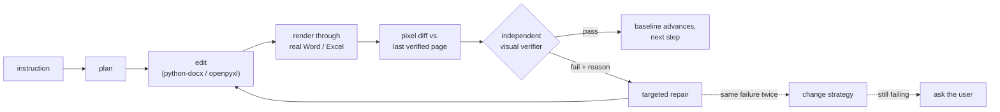

<h1 align="center">OfficeBuddy</h1>

<p align="center">
  <strong>An agent that edits your Word and Excel files — and then <em>looks at them</em> to check its own work.</strong>
</p>

<p align="center">
  <a href="LICENSE"></a>
  
  
  
</p>

<p align="center">
  <strong>English</strong> | <a href="README_zh.md">中文</a>
</p>

---

Most document agents write bytes into a file and hope. OfficeBuddy renders the document
**through Microsoft Word and Excel themselves** after every single edit, diffs the pages,
and hands the screenshot to a separate multimodal verifier that has to sign off before the
next step begins. When the verifier objects, it says *which page, which element, what is
wrong* — so the repair is targeted, not a blind retry.

The renderer is not a lookalike engine. It is Word.

## One real run, three real screenshots

Instruction: *"Make the title bold, 24pt and centered; then add a 2×3 table at the end with
headers 任务/负责人/状态 and one data row, with black solid borders."*

<table>
<tr>
<td width="33%" align="center"><strong>1 · before</strong></td>
<td width="33%" align="center"><strong>2 · after the edit</strong></td>
<td width="33%" align="center"><strong>3 · what the verifier sees</strong></td>
</tr>
<tr>
<td width="33%"></td>
<td width="33%"></td>
<td width="33%"></td>
</tr>
</table>

Every pixel above came out of real Microsoft Word on a real Mac. The red box is drawn by a
pixel diff against the last *verified* render, so the verifier is told exactly where to look
instead of re-reading the whole page.

The full evidence trail for this run — the model's plan, every tool call, the rendered PDFs,
and the verifier's structured verdicts — is checked into
[`examples/harness-walkthrough/`](examples/harness-walkthrough/).

## How the loop works



Three properties make this more than a retry wrapper:

- **The verifier is a separate, stateless call.** It never sees the edit history or the
  model's own reasoning — only the screenshot and the step description. It cannot talk
  itself into believing an edit worked.
- **The baseline ratchets.** Each new render is diffed against the last render that
  *passed*, not merely the last render produced. A failed step cannot quietly become the
  new normal.
- **Failure escalates instead of repeating.** Errors are normalized into signatures; the
  same signature twice forces a different strategy, a third time asks you. Every step and
  every task has a hard budget ceiling.

## Quick start

```bash
git clone https://github.com/richardChenzhihui/OfficeBuddy.git
cd OfficeBuddy
pip install -e .
export MINIMAX_API_KEY=...      # Anthropic-compatible endpoint, model MiniMax-M3
officebuddy doctor              # one-time automation-permission setup + self-check
```

Then just talk to it:

```bash
# one-shot, then drop into a REPL to keep going
officebuddy "把第一段改成 Times New Roman 12 号，并加粗标题" report.docx

# pure one-shot
officebuddy "add a totals row and bold it" sales.xlsx --one-shot

# interactive session
officebuddy
```

Useful flags:

| Flag | What it does |
|---|---|
| `--yes` | allow overwriting the original file (non-interactive use) |
| `--no-visual-verify` | skip the render loop — faster for pure data edits |
| `--verbose` / `-v` | show every tool call and its result |
| `--one-shot` | run the task and exit instead of entering the REPL |
| `--non-interactive` | never ask questions; take the safe default |

**Requirements:** macOS, Microsoft Word / Excel (they *are* the renderer), Python 3.10+, and a
[MiniMax](https://platform.minimaxi.com/docs/token-plan/quickstart) API key.
`office-agent` still works as an alias of the `officebuddy` command.

## What it can edit

| | Read | Edit | Rendered verification |
|---|:--:|:--:|:--:|
| Word (`.docx`) | ✅ | ✅ | ✅ |
| Excel (`.xlsx`) | ✅ | ✅ | ✅ |

**Word** — text editing and find/replace (paragraph- and run-level), character styling (font,
size, bold/italic/underline, color, **per-script CJK font slots**), paragraph styling
(alignment, indent, spacing), inserting and deleting elements (paragraphs, tables, page
breaks), table and cell borders (`tblBorders` / `tcBorders`), and structure inspection.

**Excel** — cell read/write with type preservation, formulas, cell and range styling (font,
fill, alignment, number format, borders), conditional selection (`row[Salary>5000]`-style
predicates), row/column insertion and deletion, sheet management, freeze panes, charts, and a
**fidelity guard** that inventories the workbook's parts before and after a save and reports
exactly what the underlying reader would have dropped.

## Safety, because it edits your actual files

- **Your original is never written until you say so.** All work happens on an isolated copy;
  the default output is `<name>.edited.<ext>`. Overwriting the original requires an
  interactive confirmation or `--yes`.
- **Every change is snapshotted** byte-for-byte with a persistent index — `undo` and
  `restore` work at any point.
- **Document content is data, not instructions.** Text read out of your files is never
  allowed to steer the agent (prompt-injection defense).
- **No permission dialogs during normal use.** Working copies live inside each Office app's
  own sandbox container, exports pre-delete their target, alerts are suppressed, and focus is
  never stolen. macOS asks for automation permission exactly once, and `doctor` walks you
  through it.
- **The Excel fidelity guard** warns you up front when a workbook contains parts the reader
  cannot round-trip (see Limitations).

## Architecture

```
cli.py                  REPL / one-shot / doctor
agent/
  loop.py               main harness: plan → clarify → execute → render → verify → repair
  verifier.py           independent stateless visual verification (forced structured verdict)
  budget.py             error signatures + escalation ladder (retry → new strategy → ask)
  history.py            message history (images are kept out of the main loop's context)
tools/
  registry.py           pydantic models → tool schemas; uniform error envelope; auto-snapshot
  word_tools.py         word_edit_text / edit_style / insert_element / delete_element /
                        find_replace / read_content
  excel_tools.py        excel_write_cells / edit_formula / edit_style / conditional_select /
                        create_chart / manage_sheet / freeze_panes / fidelity_report / …
  interaction_tools.py  propose_plan / update_plan / ask_user / render_preview
render/
  applescript.py        Word/Excel → PDF (in-container, dialog-free, timeout + error classes)
  pdf_to_images.py      PDF → PNG (PyMuPDF, 144 dpi)
  page_diff.py          changed-page detection + red bounding-box annotation
  renderer.py           content-addressed render cache + verified-baseline ratchet
core/
  session.py            working-copy isolation (the original is touched only on explicit save)
  snapshot_manager.py   per-step byte snapshots + persistent index (undo / restore)
adapters/               stateless python-docx / openpyxl operation layer
```

## A bug the screenshots caught by themselves

After the first demo run, plain body text showed words that looked *randomly bolder* than
their neighbours — in a paragraph the agent had never touched. Chasing it down: the source
`document.xml` had no per-character formatting at all, but `pdffonts` showed the exported PDF
embedding both `MS-Mincho` and `MicrosoftYaHei`, and a per-span extraction confirmed Word was
guessing a fallback font *per CJK character*, because the document's `Normal` style declared
no east-asian font.

That is exactly the class of defect a byte-level assertion can never see and a rendered
screenshot cannot miss. The fix — proper `w:eastAsia` font slots in the Word adapter — and the
full investigation are written up in
[`examples/harness-walkthrough/README.md`](examples/harness-walkthrough/README.md).

## Design notes

Longer write-ups on the edit layer live in [`docs/edit-layer-designs/`](docs/edit-layer-designs/):
the [native-ops router](docs/edit-layer-designs/router-native-ops.md), the
[Excel fidelity guard](docs/edit-layer-designs/excel-fidelity-guard.md), and the
[Word raw-XML patch modality](docs/edit-layer-designs/xml-patch-word.md).

There is also a self-contained visual walkthrough of the harness design at
[`examples/harness-walkthrough/visualization/harness-design-manual.html`](examples/harness-walkthrough/visualization/harness-design-manual.html)
— download it and open it in a browser.

## Limitations

- **Opening an `.xlsx` that already contains charts or images and saving it loses them.**
  openpyxl's reader does not parse them. You are warned explicitly on open and told not to
  overwrite the original; pure data and styling edits are unaffected.
- Excel charts are generated by openpyxl: the first column of the data range becomes the
  category axis by default, and the styling is plain.
- Word tracked changes, comments, footnotes and TOC field updates are not supported yet
  (planned via a Word-internal automation escape hatch). Table and cell borders *are*
  supported.
- The first Word render of a session can take 1–2 minutes while Word itself cold-starts;
  warm renders within a session take about 0.6s. Word and Excel are deliberately left running
  afterwards to preserve that warm start — `doctor` only quits instances it started.
- Paragraph-level find/replace flattens run formatting *within that paragraph* when a match
  straddles a formatting boundary. The result carries a warning when this happens.
- macOS only, by construction. The whole premise is driving real Office as the renderer.

## Development

```bash
pytest -q                    # offline suite (unit + tools + FakeLLM loop tests)
pytest -m mac_office -q      # integration tests that drive real Word/Excel
OFFICE_AGENT_LIVE_TEST=1 pytest -m live -q   # live MiniMax smoke test (costs money, skipped by default)
```

`mac_office` tests drive the real Office apps and may surface macOS permission dialogs — run
them with a human present, never unattended.

## License

MIT — see [LICENSE](LICENSE).
