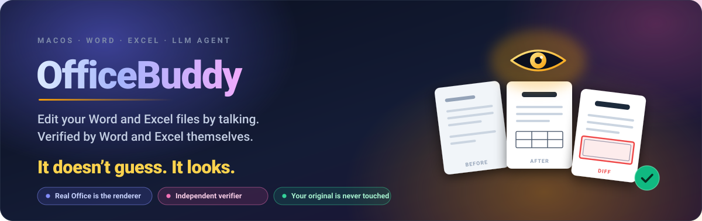
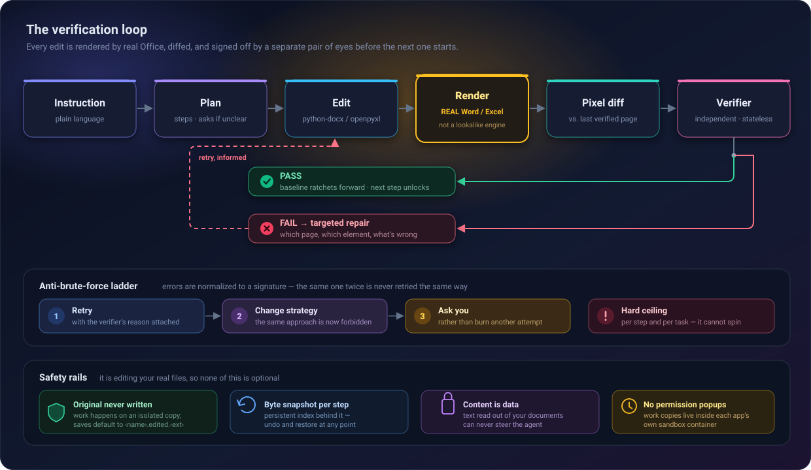
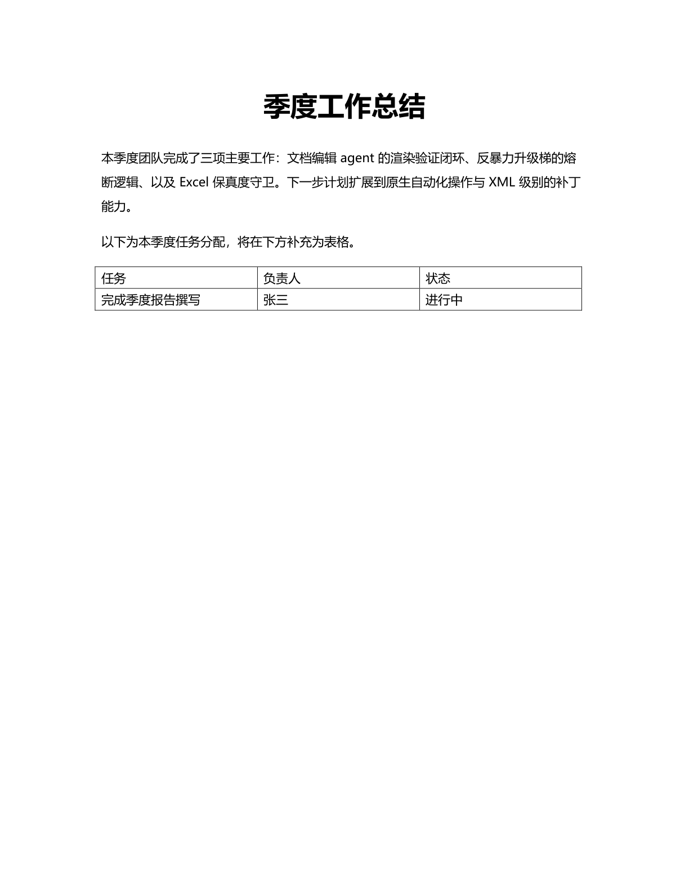
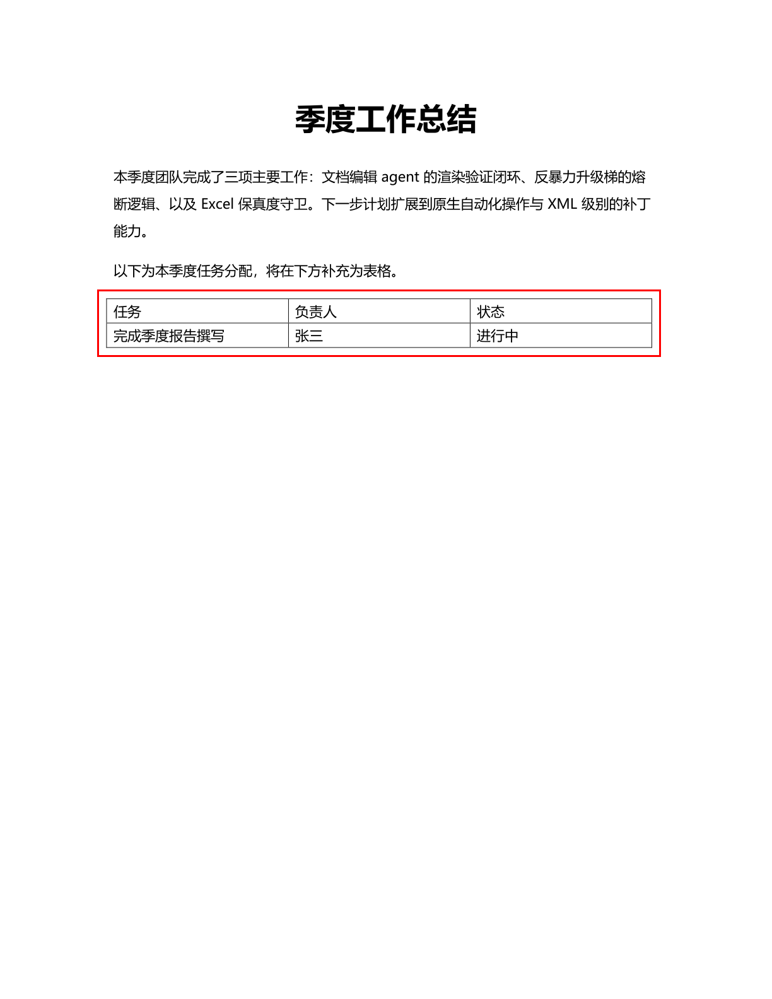

<p align="center">
  
</p>

<p align="center">
  <a href="LICENSE"></a>
  
  
  
</p>

<p align="center">
  <a href="README.md">English</a> | <strong>中文</strong>
</p>

---

大多数文档 agent 把字节写进文件就算完事，改没改对全靠祈祷。OfficeBuddy 在**每一步**编辑之后，
都用 **Microsoft Word / Excel 本体**把文档渲染出来，做像素级 diff，再把截图交给一个独立的
多模态验证器——它签字通过，下一步才能开始。验证不通过时它会明确说出**哪一页、哪个元素、
差在哪**，所以修复是定向的，不是盲目重试。

渲染器不是"高仿引擎"，它就是 Word 本身。

<p align="center">
  
</p>

## 拿证据说话

下面没有一张是效果图。这是在一台真实 Mac 上、对一份真实 `.docx`、由真实 Word 渲染出来的
一次真实运行——指令：*"把标题《季度工作总结》加粗、字号改成 24 号并居中；然后在文档末尾新增一个
2 行 3 列的表格，表头为「任务、负责人、状态」，第二行填一行示例数据，并给整个表格加上黑色实线边框。"*

<table>
<tr>
<td width="33%" align="center"><strong>1 · 改前</strong></td>
<td width="33%" align="center"><strong>2 · 改后</strong></td>
<td width="33%" align="center"><strong>3 · 验证器实际看到的图</strong></td>
</tr>
<tr>
<td width="33%"></td>
<td width="33%"></td>
<td width="33%"></td>
</tr>
</table>

那个红框不是装饰。它是拿本次渲染和上一次**通过验证的**渲染做像素 diff 画出来的——等于直接
告诉验证器"重点看这里"，而不是让它把整页重读一遍。

这次运行的全部一手材料（模型的计划、每一次工具调用、渲染出的 PDF、验证器的结构化裁决）
都提交在 [`examples/harness-walkthrough/`](examples/harness-walkthrough/)。自己翻，自己判断。

## 为什么这不只是一层"重试包装"

- **验证器是独立且无状态的调用。** 它看不到编辑历史，也看不到模型自己的推理过程，只看得到
  截图和这一步的描述——它没法自己说服自己"这步做对了"。
- **基线是棘轮式推进的。** 每次新渲染都是和上一次**通过验证**的渲染做 diff，而不是和上一次
  渲染出来的图。一个失败的步骤没法悄悄变成新的"正常"。
- **失败会升级，而不是原地重复。** 错误被归一化成签名；同一签名出现两次就强制换策略，
  第三次就来问你。每一步、每个任务都有硬预算上限。

## 快速开始

```bash
git clone https://github.com/richardChenzhihui/OfficeBuddy.git
cd OfficeBuddy
pip install -e .
export MINIMAX_API_KEY=...      # Anthropic 兼容端点，模型 MiniMax-M3
officebuddy doctor              # 一次性的自动化授权引导 + 环境自检
```

然后直接说人话：

```bash
# 一次性任务，做完后进入 REPL 继续对话
officebuddy "把第一段改成 Times New Roman 12 号，并加粗标题" report.docx

# 纯一次性
officebuddy "加一行合计并加粗" sales.xlsx --one-shot

# 直接进交互会话
officebuddy
```

常用选项：

| 选项 | 作用 |
|---|---|
| `--yes` | 允许覆盖原文件（非交互场景） |
| `--no-visual-verify` | 跳过截图验证闭环——纯数据编辑时更快 |
| `--verbose` / `-v` | 显示每次工具调用及其结果 |
| `--one-shot` | 跑完任务直接退出，不进 REPL |
| `--non-interactive` | 禁止提问，自动选安全默认项 |

**前置条件：** macOS、Microsoft Word / Excel（它们*就是*渲染器）、Python 3.10+、
以及一个 [MiniMax](https://platform.minimaxi.com/docs/token-plan/quickstart) API key。
`office-agent` 作为 `officebuddy` 的别名仍然可用。

## 能改什么

| | 读 | 改 | 渲染验证 |
|---|:--:|:--:|:--:|
| Word (`.docx`) | ✅ | ✅ | ✅ |
| Excel (`.xlsx`) | ✅ | ✅ | ✅ |

**Word** —— 文本编辑与查找替换（段落级 / run 级）、字符样式（字体、字号、粗体/斜体/下划线、
颜色、**按字形分槽的 CJK 字体**）、段落样式（对齐、缩进、行距）、插入与删除元素（段落、表格、
分页符）、表格与单元格边框（`tblBorders` / `tcBorders`）、结构读取。

**Excel** —— 保留类型的单元格读写、公式、单元格与区域样式（字体、填充、对齐、数字格式、边框）、
条件选择（`row[Salary>5000]` 这类谓词）、行列增删、工作表管理、冻结窗格、图表，以及一个
**保真度守卫**：保存前后对工作簿的 part 清单做 diff，明确告诉你底层读取器丢掉了什么。

## 安全性（毕竟它动的是你的真文件）

- **在你明确同意之前，原文件永不写入。** 所有操作都在隔离的工作副本上进行，默认输出
  `<name>.edited.<ext>`；覆盖原文件需要交互确认或 `--yes`。
- **每次变更都有字节级快照**，配持久化索引——任何时候都能 `undo` / `restore`。
- **文档内容是数据，不是指令。** 从你文件里读出来的文本永远不能反过来操纵 agent（防 prompt injection）。
- **正常使用不会弹任何权限框。** 工作副本放在 Office 各自的沙盒容器内，导出前预删目标文件、
  关闭 alerts、不抢焦点。macOS 只在第一次要一次自动化授权，`doctor` 会引导你完成。
- **Excel 保真度守卫**会在工作簿含有底层读取器无法往返的内容时提前警告（见「已知限制」）。

## 架构

```
cli.py                  REPL / 一次性任务 / doctor
agent/
  loop.py               harness 主循环：计划 → 反问 → 执行 → 渲染验证 → 定向修复
  verifier.py           独立无状态视觉验证调用（强制结构化裁决）
  budget.py             错误签名 + 升级阶梯（重试 → 换策略 → 问用户）
  history.py            消息历史管理（图片不进主循环上下文）
tools/
  registry.py           pydantic 模型 → tool schema；统一错误包装；自动快照
  word_tools.py         word_edit_text / edit_style / insert_element / delete_element /
                        find_replace / read_content
  excel_tools.py        excel_write_cells / edit_formula / edit_style / conditional_select /
                        create_chart / manage_sheet / freeze_panes / fidelity_report / …
  interaction_tools.py  propose_plan / update_plan / ask_user / render_preview
render/
  applescript.py        Word/Excel → PDF（容器内、零弹窗、超时 + 错误分类）
  pdf_to_images.py      PDF → PNG（PyMuPDF，144dpi）
  page_diff.py          变更页检测 + 红框标注
  renderer.py           内容寻址的渲染缓存 + 已验证基线棘轮
core/
  session.py            工作副本隔离（原文件只在显式 save 时写）
  snapshot_manager.py   每步字节快照 + 持久化索引（undo / restore）
adapters/               python-docx / openpyxl 无状态操作层
```

## 一个被截图自己抓出来的 bug

第一次跑完演示后，正文里出现了看起来"随机加粗"的词——而那一段 agent 从来没碰过。顺着查下去：
源文件 `document.xml` 里那段根本没有任何逐字符格式，但 `pdffonts` 显示导出的 PDF 同时嵌入了
`MS-Mincho` 和 `MicrosoftYaHei`，按 span 逐字提取后确认：Word 在导出时**对每个 CJK 字符单独猜**
用哪个后备字体，因为文档的 `Normal` 样式压根没声明东亚字体。

这正是字节级断言永远看不见、而渲染截图不可能漏掉的一类缺陷。修复（在 Word adapter 里正确写入
`w:eastAsia` 字体槽）和完整排查过程记录在
[`examples/harness-walkthrough/README.md`](examples/harness-walkthrough/README.md)。

## 设计文档

编辑层的详细设计写在 [`docs/edit-layer-designs/`](docs/edit-layer-designs/)：
[原生操作路由](docs/edit-layer-designs/router-native-ops.md)、
[Excel 保真度守卫](docs/edit-layer-designs/excel-fidelity-guard.md)、
[Word 裸 XML 补丁模态](docs/edit-layer-designs/xml-patch-word.md)。

另外还有一份自包含的 harness 设计可视化手册：
[`examples/harness-walkthrough/visualization/harness-design-manual.html`](examples/harness-walkthrough/visualization/harness-design-manual.html)
——下载后用浏览器打开即可。

## 已知限制

- **打开本来就带图表/图片的 `.xlsx` 再保存会丢失这些图表/图片**（openpyxl 读取器不解析它们）。
  打开时会显式警告并提示不要覆盖原文件；纯数据 / 样式编辑不受影响。
- Excel 图表由 openpyxl 生成：数据区首列默认作为类别轴标签，其余样式较朴素。
- Word 修订、批注、脚注、TOC 域更新等高级特性暂不支持（计划通过 Word 内部自动化逃生舱补充）。
  表格 / 单元格边框**已经支持**。
- 会话内第一次 Word 渲染可能需要 1–2 分钟（Word 本体冷启动）；会话内温启动约 0.6 秒。
  会话结束后 Word/Excel 会保持运行以保留温启动——`doctor` 只退出它自己启动的实例。
- 段落级 find/replace 在匹配跨越格式边界时会展平该段的 run 格式（结果中会带 warning）。
- 只支持 macOS，这是设计使然——整个前提就是驱动真实 Office 当渲染器。

## 开发

```bash
pytest -q                    # 离线测试（单元 + 工具 + FakeLLM 循环测试）
pytest -m mac_office -q      # 驱动真实 Word/Excel 的集成测试
OFFICE_AGENT_LIVE_TEST=1 pytest -m live -q   # 真实 MiniMax 冒烟测试（花钱，默认跳过）
```

`mac_office` 测试会驱动真实的 Office 应用，可能弹出 macOS 权限框——请在有人值守时运行，
不要无人值守地跑。

## 许可证

MIT，见 [LICENSE](LICENSE)。
