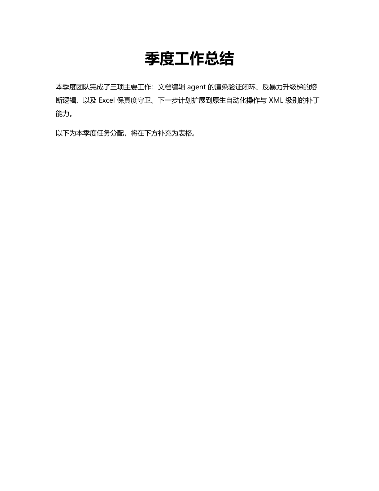

# Harness 实操教程：一次真实的 Plan → Execute → Render → Verify 全流程

这个文件夹不是虚构的示意图——它是 `run_demo.py` 对着一份真实 `.docx` 跑了一次
`office-agent` harness 之后，**在会话清理删除产物之前**原样抢救下来的全部一手材料：
真实的 MiniMax-M3 对话、真实的 Word 渲染 PDF/PNG、真实的独立视觉验证器裁决 JSON。
配合 [`visualization/harness-design-manual.html`](visualization/harness-design-manual.html)
（同一个 harness 的架构设计手册）一起看：手册讲机制是什么、为什么这么设计；这个文件夹
让你看到这些机制在一次真实运行里具体长什么样。

如果只想看结果不想读文件：[`visualization/run-visualization.html`](visualization/run-visualization.html)
把下面这些证据做成了一个可以直接打开看的单页可视化——真实截图（含原始文档的补充渲染、
before/after/红框标注三连图）、真实耗时拆解（渲染 vs 独立验证各花多久）、每一步的完整裁决，
全部内嵌成一个自包含的 HTML，不需要逐个打开 JSON/PNG。

## 这次实操做了什么

```
输入: input/quarterly_summary.docx  ——  一份朴素的季度总结文档（标题 + 两段正文，无样式）
指令: 见 run/instruction.txt
输出: output/quarterly_summary.edited.docx
```

> 把标题《季度工作总结》加粗、字号改成24号并居中；然后在文档末尾新增一个2行3列的表格，
> 表头为"任务、负责人、状态"，第二行填一行示例数据，并给整个表格加上黑色实线边框。

模型（MiniMax-M3）自己把这拆成了 3 步计划（[`run/plan_final.json`](run/plan_final.json)），
三步全部一次性通过独立视觉验证，从未触发升级梯——这是**真实模型输出**，不是为了演示而摆拍的。
（`events.jsonl` 里唯一的插曲：模型第一次 `get_structure` 时把文件名当成了 `doc_id`，
拿到结构化错误后立刻用正确的 `doc_id` 重试成功；这发生在 `propose_plan` 之前，
`budget.reset_steps()` 会在提出计划时清空这类记账，所以它没有占用任何一步的升级梯配额。）

| plan `index`（对应 `renders/step-N`） | 计划步骤 | 用到的工具 | 视觉验证 |
|---|---|---|---|
| 0（→ step-1） | 标题加粗、24pt、居中 | `word_edit_style` | ✅ 通过（置信度 0.97） |
| 1（→ step-2） | 插入 2×3 表格并填数据 | `word_insert_element` | ✅ 通过（置信度 0.97） |
| 2（→ step-3） | 给表格加黑色实线边框 | `word_edit_style` | ✅ 通过（置信度 0.95，见下方"没有像素差异"的真实案例） |

（这套材料被重新跑过一次——见下方[「一个被截图自己暴露出来的字体 bug」](#一个被截图自己暴露出来的字体-bug)——所以这里的置信度和下面的工具调用参数是**第二次**真实运行的结果，不是最初那次；两次运行模型选的计划描述、选择器写法略有不同，都是真实的 MiniMax-M3 输出。）

## 怎么复现

```bash
cd examples/harness-walkthrough
python make_input.py   # 重新生成 input/quarterly_summary.docx（可选，已经生成过一次）
python run_demo.py     # 真实调用 MiniMax-M3 + 真实驱动本机 Word——需要 MINIMAX_API_KEY，
                        # macOS + Microsoft Word，会产生真实（很小额度）的 API 费用
```

`run_demo.py` **不经过 CLI**，而是直接驱动 `AgentSession`——和 `office-agent` 命令行用的是
同一个公开入口，唯一的区别是它跳过了 `cli.py` 结尾那句
`session.ctx.sessions.close_all()`。那句话会调用 `EditSession.cleanup()`
（`src/office_agent/core/session.py:356-358`）把整个 session 工作目录连同渲染出的 PDF/PNG
和 `audit.jsonl` 一起 `shutil.rmtree` 掉——这是正常使用时的期望行为（不留垃圾），但也意味着
如果不在清理前把东西抢出来，这次演示就什么都留不下。`run_demo.py` 用一个自定义的
`RecordingUI`（继承 `agent/loop.py` 的 `BaseUI` 协议）把每个 `tool_call` / `tool_result` /
`plan_update` / `notify` 事件都记录成结构化 JSON，并且**猴子补丁**了
`agent.loop.verify_edit`，因为主循环只把验证结果的 `.summary()` 文本转给 UI
（`agent/loop.py:692`），完整的 `VerificationResult`（`passed` / `confidence` / `problems[]`）
默认根本不会被持久化到任何地方。

## 每一步的证据

### 步骤 0 · 标题样式

- 工具调用：`word_edit_style(selector={contains:"季度工作总结",occurrence:"first",type:text_match}, style_params={alignment:center, bold:true, font_size:24})`
- 渲染产物：[`renders/step-1/render.pdf`](renders/step-1/render.pdf) ·
  
- 这是第一次渲染，此时 `renderer.baseline` 还是 `None`（`render/renderer.py:61`），
  所以 `_verify_doc` 走的是"无基线对比"分支（`agent/loop.py:677-678`）——验证器只看
  单张 AFTER 图，不做 diff。裁决见 [`run/verify_results.json`](run/verify_results.json) 第 1 条。

### 步骤 1 · 插入表格

- 工具调用：`word_insert_element(element_type=table, content=[["任务","负责人","状态"],["完成季度报告撰写","张三","进行中"]])`
- 渲染产物：[`renders/step-2/render.pdf`](renders/step-2/render.pdf)
- **这一步能看到 baseline 棘轮机制真正生效**：AFTER 图对着步骤 0 通过验证后的渲染做了
  像素 diff，检测到变化区域，`highlight_region()`（`render/page_diff.py` +
  `render/renderer.py`）画出了红框标注：

  before（步骤 0 的验证基线） | after（本步渲染） | 红框标注（实际发给验证器的图）
  :---:|:---:|:---:
   |  | 

  裁决见 `verify_results.json` 第 2 条：`before_pages_shown: [0]`——这次验证器同时拿到了
  before/after 两张图，不再是步骤 0 那种"只看 after"。

### 步骤 2 · 表格加边框——一个真实的"零像素差异"案例

- 工具调用：`word_edit_style(selector={table_index:0,type:table}, style_params={border:{color:#000000,size:0.5,style:single}})`
- 渲染产物：[`renders/step-3/render.pdf`](renders/step-3/render.pdf) ·
  
- **这不是摆拍的边界案例，是这次真实运行里自己发生的**：`python-docx` 的
  `doc.add_table()` 默认套用 "Table Grid" 样式（步骤 1 插入表格时就已经带上了肉眼可见的
  黑色细线边框），所以步骤 2 显式加"黑色实线边框"之后，像素 diff 与步骤 1 的渲染相比
  低于 8/255 的容差阈值（`render/page_diff.py:50`），触发了
  `agent/loop.py:670-676` 那条"检测不到可见变化"分支：

  ```json
  "extra_note": "NOTE: pixel diff detected NO visible change since the last
  verified render, despite edits being applied. Check carefully whether the
  intended change is actually present."
  ```

  验证器在拿到这条提示后，仍然独立判断 AFTER 图里表格确实带有边框、符合步骤意图，给出
  `passed=true, confidence=0.95`——这正是设计手册里"棘轮防 diff-laundering"机制的另一面：
  它不会因为"没测出像素差异"就自动判定失败,而是把这个情况**如实告诉独立验证器**,
  让验证器基于图像本身做判断,而不是让代码替它下结论(呼应项目的"语义判断必须来自 LLM"
  原则)。完整裁决见 `verify_results.json` 第 3 条。

## 没有在这次运行里发生的事

这是一次指令清晰、模型一次做对的干净运行——**反暴力升级梯没有被触发**。
`run/events.jsonl` 里看不到任何 `SWITCH_STRATEGY` 或 `ASK_USER`。想看这条路径实际长什么样，
去看设计手册的 [反暴力升级梯](visualization/harness-design-manual.html#escalation) 一节和
`src/office_agent/agent/budget.py:99-118`——那段状态机是被代码强制执行的，不需要真的失败
两次也能读懂它会怎么判断。诚实起见：这份材料证明的是"清晰指令下闭环如何顺畅工作"，
不是"升级梯如何被触发"，两者是这个 harness 里不同但互补的部分。

## 一个被截图自己暴露出来的字体 bug

第一次跑完这次演示后，plain 文本段落里出现了看起来"随机加粗"的词——同一句话里
"团队"两个字明显比旁边的字粗，但那段文字从来没有被 office_agent 编辑过。这不是我编的
边界案例，是真实截图自己暴露出来的问题，值得完整记一下排查过程：

1. **先排除 office_agent 自己的锅**：`input/quarterly_summary.docx` 的 `word/document.xml`
   显示那一整段是单个 `<w:r>`，没有任何 `<w:rPr>`——docx 源文件里根本没有逐字符的格式差异。
2. **用 `pdffonts` 看导出的 PDF**：连从未被编辑过的原始文档，导出的 PDF 里也同时嵌入了
   `MS-Mincho` 和 `MicrosoftYaHei` 两种字体。
3. **用 PyMuPDF 按 span 抽取字体**，逐字符核对，确认同一句话里"团队"用 YaHei、
   "完成了三"用 Mincho、"项"用 YaHei——这正是"随机加粗"观感的来源：Word 在导出 PDF 时
   对每个 CJK 字符单独猜测该用哪个后备字体，猜出来的两种字体粗细观感不同。

**根因**：`make_input.py` 用一个空白的 `python-docx Document()` 生成"改前"文档，其
`Normal` 样式完全没有声明任何字体（`styles.xml` 里 `w:styleId="Normal"` 连 `w:rPr` 都没有）。
Word 打开/导出这种文档时，只能对 CJK 字符逐字猜测后备字体，猜得不一致。

**修完 `make_input.py`（显式钉死 `w:eastAsia` 字体）之后，更有意思的事发生了**：新插入的
**表格**里同样的问题又出现了一次——这次不是我的 demo 脚本的锅，而是
`src/office_agent/adapters/word_adapter.py` 自己的 bug：

```python
# 修复前
table.rows[i].cells[j].text = str(cell_data)
```

`python-docx` 的 `cell.text = ...` 会创建一个全新的 run，同样不带任何字体声明。更进一步排查发现，
**`apply_style` 的 `font_name` 参数本身就是坏的**：`run.font.name = style.font_name` 在 python-docx
里只写 `w:rFonts/@w:ascii`（西文字体），从来不碰 `@w:eastAsia`——也就是说，在这次修复之前，
如果有人让 agent"把字体改成宋体"，中文字符会**完全不受影响**，请求被静默忽略。

修复（`word_adapter.py`）：

- 新增 `_set_east_asian_font()` / `_east_asian_font()` / `_dominant_document_font()` 三个 helper；
- `_apply_run_style` 现在同时写 `@w:eastAsia`，`font_name` 请求对中文真正生效；
- `_copy_run_format`（INSERT/APPEND 时复制格式）现在把源 run 的东亚字体也带过去；
- `insert_element` 新建表格/段落时，会去文档里找"第一个显式设置过字体的 run"，把同样的字体
  套用到新内容上——找不到就不发明一个（文档本来就没有字体信息时，行为不变）。

新增 5 个回归测试（`tests/unit/test_word_adapter.py`），**175 个测试全绿**；然后带着这个修复
把整个演示重新跑了一遍真实的 harness（这个文件夹里现在看到的截图、JSON、耗时都是**修复之后**
这一次真实运行的产物）——用 `pdffonts` + PyMuPDF 核对，最终页面上只剩 `MicrosoftYaHei` /
`MicrosoftYaHei-Bold` / `Cambria` 三种字体，`MS-Mincho` 完全消失，表格文字也不例外。

这个插曲本身也是这套 harness 设计哲学的一个真实注脚：截图验证闭环不只是给 LLM 验证器用的，
它把渲染结果的每一个细节都摊在你面前——包括代码作者自己都没意识到的 bug。

## 文件夹结构

```
harness-walkthrough/
├── README.md                  本文件
├── make_input.py               生成 input/ 里那份"改前"文档的脚本
├── run_demo.py                 驱动真实 harness 并抢救产物的脚本（可重复运行）
├── input/quarterly_summary.docx        改前文档
├── output/quarterly_summary.edited.docx 改后文档（agent 实际保存的那份，原样拷贝）
├── audit.jsonl                  session.audit() 的机读日志：每次成功的 registry 工具调用
├── run/
│   ├── instruction.txt          给模型的原始自然语言指令
│   ├── events.jsonl              完整结构化事件流：assistant_text/tool_call/tool_result/
│   │                              plan_update/verify_result/notify，按时间顺序
│   ├── plan_final.json           计划的最终状态（3 步全部 done）
│   ├── verify_results.json       3 次独立视觉验证的完整结构化裁决（不是摘要文本）
│   ├── turn_result.json          AgentSession.run_turn() 返回的 TurnResult
│   └── console_transcript.txt    人类可读的运行时终端输出（tee 下来的原始 stdout）
├── renders/
│   ├── step-0-original/  render.pdf + page_000.png                （补充渲染：未编辑的原始文档，
│   │                                                                 仅为可视化页面的 hero 对比生成，
│   │                                                                 不是原始 agent 运行的一部分）
│   ├── step-1/  render.pdf + page_000.png                       （标题样式后）
│   ├── step-2/  render.pdf + page_000.png + annotated_page_000.png （插入表格后，含红框标注）
│   └── step-3/  render.pdf + page_000.png                        （加边框后）
└── visualization/
    ├── harness-design-manual.html   同一个 harness 的架构设计手册（可交互）
    └── run-visualization.html        本次真实运行的单页可视化（自包含，图片已内嵌）
```

## 和设计手册的对应关系

| 这次运行里的证据 | 手册里的机制 | 源码 |
|---|---|---|
| `verify_results.json` 每条都是独立一次性调用产出 | 独立无状态视觉验证器 | `agent/verifier.py:58-141` |
| step-2 的 before/after/annotated 三张图 | Baseline 棘轮 + 红框标注 | `agent/loop.py:647-676`、`render/page_diff.py` |
| step-3 的 `extra_note` | "零像素差异"防御分支 | `agent/loop.py:670-676` |
| `audit.jsonl` 有 6 条：2 次 `get_structure`（只读）也在列，但只有 `mutates=True` 的 3 条（`word_edit_style` ×2、`word_insert_element`）额外带了 `snapshot_id` | `registry.dispatch` 里 audit 和 snapshot 是两道独立的闸（`tools/registry.py:100-111`）：任何带 `doc_id` 的成功调用都记 audit，只有 `mutates=True` 才多打一次快照；`open_document`（此刻 doc_id 还不存在）和 `propose_plan`/`update_plan` 等 harness 工具（走 `loop.py` 直接处理，从不经过 `registry.dispatch`）因此都不出现在这份日志里 | `tools/registry.py:100-111` |
| `output/quarterly_summary.edited.docx` 落在 `<name>.edited.<ext>`，原文件未动 | 写入需显式确认 | `core/session.py:300-345` |
| 截图暴露出的 CJK 字体不一致 bug（见上一节） | `font_name` 只写西文字体、从不碰 `w:eastAsia` | `adapters/word_adapter.py`（`_apply_run_style` / `_copy_run_format` / `insert_element`），回归测试见 `tests/unit/test_word_adapter.py` |
